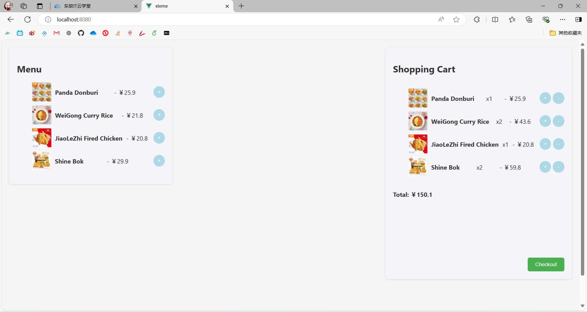

# Shopping Cart Application

## Introduction

This is a simple shopping cart application built with Vue.js. The application allows users to browse a menu of items, add items to their cart, and manage the items in the cart with options to increase, decrease, or remove items. The total price of the items in the cart is calculated dynamically.

## Features

- **Menu Display**: Shows a list of available items with images, names, and prices.
- **Add to Cart**: Users can add items to their shopping cart.
- **Manage Cart Items**: Users can increase, decrease, or remove items from the cart.
- **Total Price Calculation**: The total price of the items in the cart is updated automatically.
- **Checkout**: A checkout button is provided to simulate the payment process.

## How to run

1. **Clone the repository:**
   
   ```sh
   git clone https://github.com/lapismind/shopping-cart-app.git
   cd shopping-cart-app
   ```
2. **Install dependencies:**
   
   ```sh
   pnpm install
   ```
3. **Run the development server:**
   
   ```sh
   pnpm run serve
   ```
4. **Open the application in your browser:**
   
   ```sh
   http://localhost:8080
   ```

## Screenshot



## Project Structure

- `src/`
  - `assets/` - Contains images and other static assets.
  - `components/` - Contains Vue components like `Menu.vue` and `ShoppingCart.vue`.
  - `store/` - Contains Vuex store configuration.
  - `views/` - Contains view components like `Home.vue`.
  - `App.vue` - Root component.
  - `main.js` - Application entry point.

## Dependencies

- Vue 3
- Vuex
- Vue Router

## License

This project is licensed under the MIT License.

## Components

### Menu Component

The Menu component displays a list of items that users can add to their cart. Each item includes an image, name, and price, and an "Add to Cart" button.

```vue
<template>
    <div class="order-container">
        <h2>Menu</h2>
        <ul>
            <li v-for="item in items" :key="item.id" class="menu-item">
                
                <div class="item-details">
                    <span class="item-name">{{ item.name }}</span> - ￥{{ item.price.toFixed(1) }}
                    <button @click="addToCart(item)">+</button>
                </div>
            </li>
        </ul>
    </div>
</template>

<script>
export default {
    data() {
        return {
            items: [
                { id: 1, name: 'Panda Donburi', price: 25.9, image: require('@/assets/images/Orders/1.png') },
                { id: 2, name: 'WeiGong Curry Rice', price: 21.8, image: require('@/assets/images/Orders/2.png')},
                { id: 3, name: 'JiaoLeZhi Fired Chicken', price: 20.8, image: require('@/assets/images/Orders/3.png')},
                { id: 4, name: 'Shine Bok', price: 29.9, image: require('@/assets/images/Orders/4.png')}
            ]
        }
    },
    methods: {
        addToCart(item) {
            this.$emit('add-to-cart', item);
        }
    }
}
</script>


```

### ShoppingCart Component

The ShoppingCart component displays the items that have been added to the cart. It allows users to increase or decrease the quantity of each item, remove items from the cart, and view the total price.

```
<template>
    <div class="shopping-cart">
        <h2>Shopping Cart</h2>
        <ul>
            <li v-for="item in cartItems" :key="item.id" class="cart-item">
                <span class="item-name">{{ item.name }}</span>
                <div class="item-controls">
                    <button @click="decreaseQuantity(item)">-</button>
                    <span class="item-quantity">{{ item.quantity }}</span>
                    <button @click="increaseQuantity(item)">+</button>
                </div>
                <button @click="removeFromCart(item)" class="remove-button">x</button>
                <span class="item-total">￥{{ (item.price * item.quantity).toFixed(1) }}</span>
            </li>
        </ul>
        <div class="total">
            <strong>Total: ￥{{ total.toFixed(1) }}</strong>
        </div>
        <button class="checkout-button">Checkout</button>
    </div>
</template>

<script>
export default {
    props: ['cartItems'],
    computed: {
        total() {
            return this.cartItems.reduce((sum, item) => sum + item.price * item.quantity, 0);
        }
    },
    methods: {
        increaseQuantity(item) {
            this.$emit('update-quantity', item, 1);
        },
        decreaseQuantity(item) {
            this.$emit('update-quantity', item, -1);
        },
        removeFromCart(item) {
            this.$emit('remove-from-cart', item);
        }
    }
}
</script>
```
